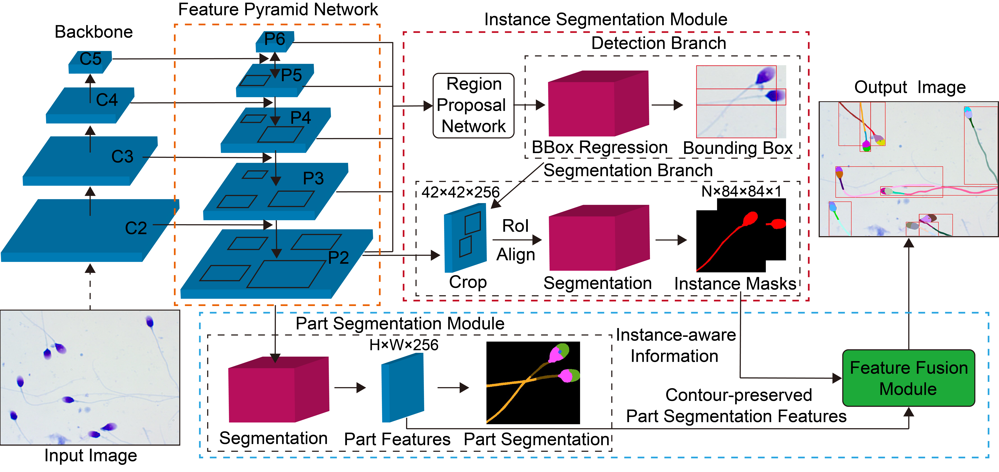

# Sperm-Parsing
Official implementation of **Sperm Parsing Net: Instance-Aware Part Segmentation of Human Sperm**

In this repository, we release the SP-Net code in Pytorch and the proposed Sperm Parsing Dataset

The dataset is in mmdetection-github/data/spermparsing.

This network is based on the framework of mmdetection.

- SP-Net architecture:
<p align="center"></p>

- SP-Net output:
<p align="center"></p>

## Installation
- mmcv.1.6.0
- pytorch.1.12.1

## Evaluation
```
python tools/test.py configs/git_fusionrcnn/cascade_mask_rcnn_r101_caffe_feature_blend_coarse_fine_edge_fpn_1x_spermparsingeval.py epoch_35.pth --eval bbox segm

## Results and Models
**on Sperm Parsing Dataset**

|  Backbone  | mIoU |Parsing (APp50/APvol/PCP50) | DOWNLOAD |
|------------|:----:|:--------------------------:| :-------:|
|  R-50-FPN  | 70.1 |      60.2/80.6/70.1        |          |
|  R-101-FPN | 70.6 |      61.5/83.3/72.5        | [GoogleDrive](https://drive.google.com/file/d/1bFhdgD3SrSB7gvvRKnx_sX_KjFaf85q_/view?usp=drive_link)|

## Evaluation
```
python tools/test.py configs/git_fusionrcnn/cascade_mask_rcnn_r101_caffe_feature_blend_coarse_fine_edge_fpn_1x_spermparsingeval.py epoch_35.pth --eval bbox segm
```
